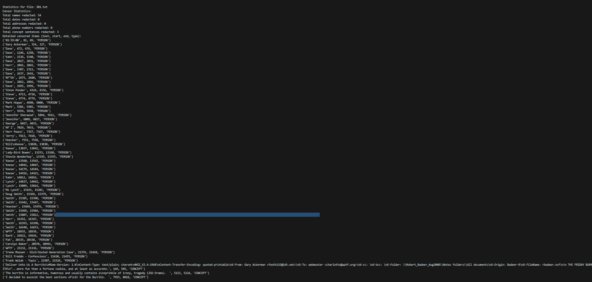
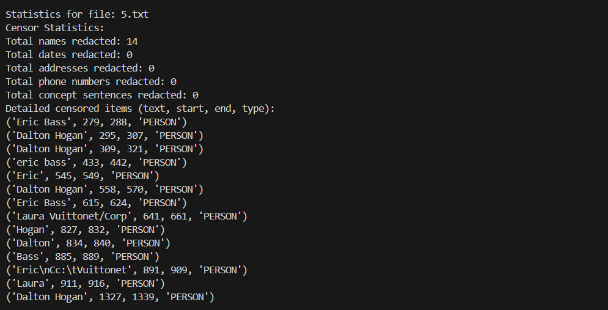
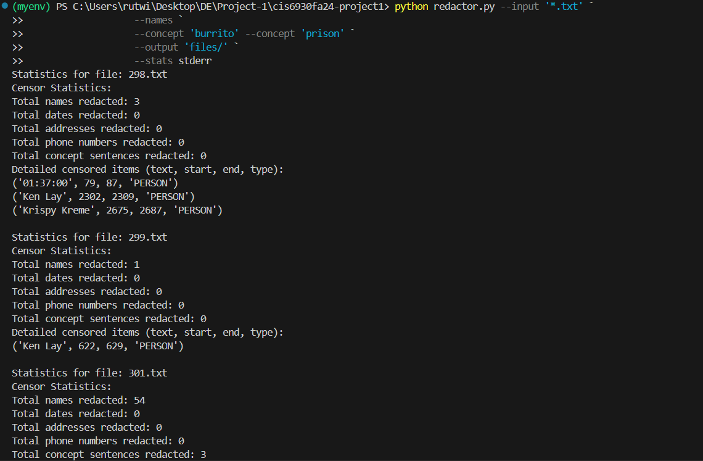
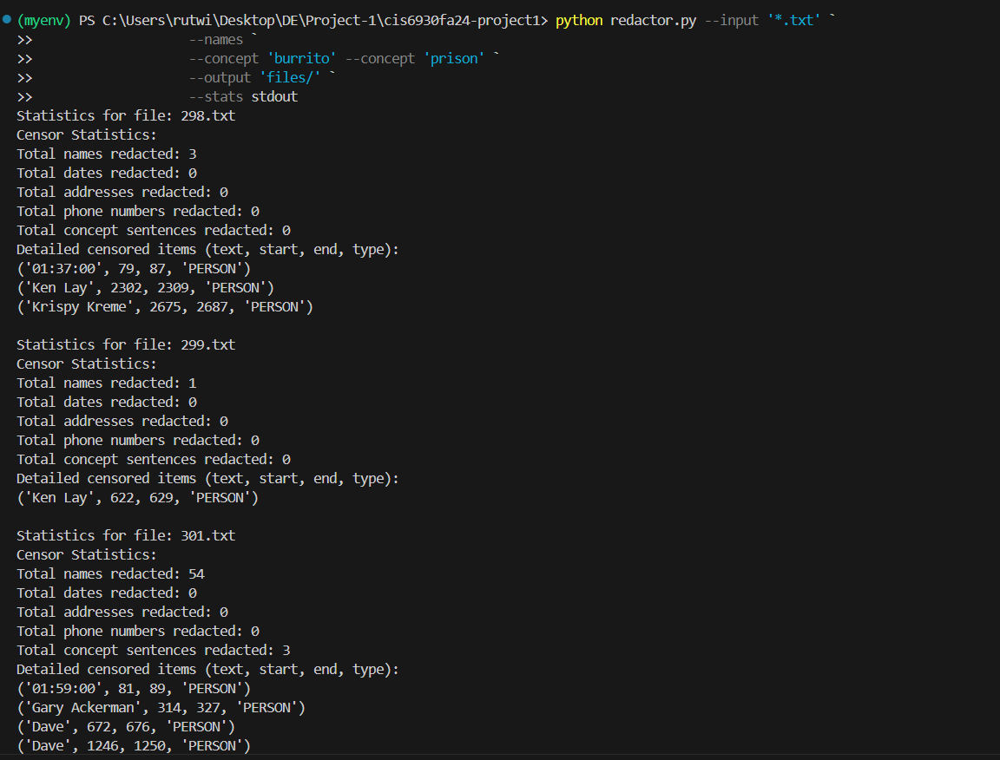
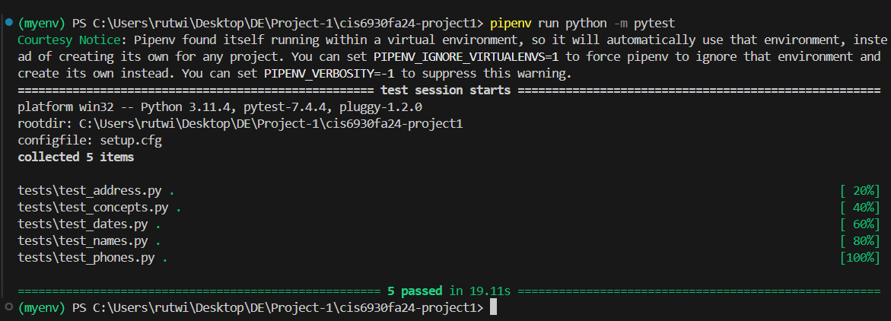

# README.md

## AUTHOR: RUTWIK SARAF

### INTRODUCTION

THIS PROJECT IS A PYTHON APPLICATION DESIGNED TO REDACT SENSITIVE INFORMATION (SUCH AS NAMES, DATES, ADDRESSES, PHONE NUMBERS, AND CONCEPTUAL TERMS) FROM TEXT FILES. USING VARIOUS NLP TECHNIQUES VIA THE SPACY LIBRARY, THE APPLICATION IDENTIFIES SPECIFIC ENTITY TYPES WITHIN TEXT AND OBFUSCATES THEM ACCORDINGLY.

### FUNCTION OVERVIEW

1. **READINGINPUT(FILE_TYPE)**: THE READINGINPUT FUNCTION PROCESSES MULTIPLE FILES THAT MATCH A SPECIFIED PATTERN (LIKE *.TXT) FROM THE DIRECTORY, STORING THEIR CONTENT IN A DICTIONARY. IT STARTS BY CALLING GLOB.GLOB(FILE_TYPE), WHICH SEARCHES FOR FILES THAT MATCH THE GIVEN FILE_TYPE PATTERN (E.G., ALL .TXT FILES), RETURNING A LIST OF FILE NAMES THAT MATCH. THE FUNCTION THEN INITIALIZES AN EMPTY DICTIONARY CALLED CONTENT, WHICH WILL HOLD EACH FILE'S CONTENT UNDER ITS FILE NAME AS A KEY-VALUE PAIR. FOR EACH FILE FOUND, IT OPENS THE FILE IN READ MODE ('R') WITH UTF-8 ENCODING, WHICH ENSURES CONSISTENT HANDLING OF TEXT ACROSS VARIOUS LANGUAGES AND SPECIAL CHARACTERS. USING A CONTEXT MANAGER (WITH OPEN(...) AS F:), IT READS THE ENTIRE CONTENT OF EACH FILE AND STORES THIS CONTENT IN THE CONTENT DICTIONARY WITH THE FILE NAME AS THE KEY. AFTER PROCESSING ALL FILES, THE FUNCTION RETURNS THE CONTENT DICTIONARY, WHICH HOLDS ALL FILE DATA ORGANIZED BY FILE NAME. THIS DESIGN MAKES IT EASY TO COLLECT, STORE, AND ACCESS TEXTUAL DATA FROM MULTIPLE SOURCES AT ONCE, WHICH IS IDEAL FOR APPLICATIONS REQUIRING BATCH PROCESSING OF TEXT FILES OR ORGANIZED PREPROCESSING FOR LARGER TEXTUAL DATASETS.

2. **REDACT_NAMES(TEXT, DOC, STATS)**: THE REDACT_NAMES FUNCTION TAKES THREE INPUTS: A TEXT STRING (TEXT), A PROCESSED SPACY DOCUMENT (DOC), AND A STATISTICS DICTIONARY (STATS). IT USES A LIST REPRESENTATION OF THE ORIGINAL TEXT (REDACTED_TEXT) TO EASILY MANIPULATE SPECIFIC CHARACTER POSITIONS WHILE REDACTING. THE FUNCTION LOOPS THROUGH ALL NAMED ENTITIES IN THE DOCUMENT, IDENTIFIED BY THE SPACY NLP MODEL. WHEN AN ENTITY WITH A LABEL OF "PERSON" (INDICATING A NAME) IS DETECTED, THE FUNCTION CALCULATES ITS START AND END CHARACTER POSITIONS WITHIN THE TEXT USING ENTITY.START_CHAR AND ENTITY.END_CHAR. IT THEN REPLACES CHARACTERS BETWEEN THESE POSITIONS WITH BLOCK CHARACTERS (█), REDACTING THE NAME WHILE PRESERVING THE LENGTH OF THE ORIGINAL TEXT FOR ACCURACY. AS EACH NAME IS REDACTED, THE FUNCTION INCREMENTS THE NAMES COUNT IN THE STATS DICTIONARY AND APPENDS A TUPLE WITH THE ORIGINAL ENTITY TEXT, START POSITION, END POSITION, AND ENTITY LABEL TO TRACK REDACTED DATA FOR LATER REFERENCE. FINALLY, THE FUNCTION RETURNS THE REDACTED TEXT AS A STRING BY JOINING THE MODIFIED LIST BACK INTO A SINGLE STRING.

3. **REDACT_DATES(TEXT, DOC, STATS)**: THE REDACT_DATES FUNCTION TAKES IN A TEXT STRING (TEXT), A SPACY DOCUMENT OBJECT (DOC), AND A STATISTICS DICTIONARY (STATS). IT STARTS BY CREATING A SPACY MATCHER OBJECT TO IDENTIFY DATE PATTERNS IN THE TEXT. THREE PATTERNS ARE SPECIFIED IN THE DATE_PATTERNS LIST: (1) DATES WITH A DAY NUMBER FOLLOWED BY A MONTH AND YEAR, (2) DATES BEGINNING WITH A MONTH, FOLLOWED BY A DAY NUMBER AND YEAR, AND (3) DATES IN MM/DD/YYYY FORMAT. EACH PATTERN USES REGULAR EXPRESSIONS TO MATCH NUMERIC DAY VALUES OR SLASH-DELIMITED FORMATS AND INCLUDES MONTH NAMES TO CAPTURE DATE STRUCTURE. THE MATCHER.ADD FUNCTION ASSOCIATES THESE PATTERNS WITH A UNIQUE DATE LABEL, WHICH THEN SCANS THE TEXT FOR ALL MATCHES.

 - THE MATCHES ARE STORED IN MATCHES, AND REDACTED_TEXT HOLDS THE ORIGINAL TEXT AS A LIST FOR EASY CHARACTER-BY-CHARACTER MODIFICATION. FOR EACH MATCH, THE FUNCTION IDENTIFIES THE START AND END CHARACTER POSITIONS, THEN REPLACES CHARACTERS IN THAT RANGE WITH BLOCK CHARACTERS (█), EFFECTIVELY REDACTING THE DATE. EACH REDACTED DATE UPDATES THE DATES COUNT IN STATS, AND THE ENTITY TEXT, START POSITION, END POSITION, AND ENTITY LABEL ARE APPENDED TO STATS["ENTITIES"]. FINALLY, THE FUNCTION RETURNS THE REDACTED TEXT AS A STRING, JOINING THE MODIFIED LIST BACK INTO A SINGLE TEXT OUTPUT.

4. **REDACT_ADDRESSES(TEXT, DOC, STATS)**: THE REDACT_ADDRESSES FUNCTION IS DESIGNED TO FIND AND REDACT ADDRESS-RELATED INFORMATION IN A GIVEN TEXT. IT TAKES THREE PARAMETERS: THE TEXT STRING (TEXT), A SPACY DOCUMENT OBJECT (DOC), AND A STATISTICS DICTIONARY (STATS). THE FUNCTION BEGINS BY CONVERTING THE INPUT TEXT INTO A LIST, STORED IN REDACTED_TEXT, TO ALLOW CHARACTER-LEVEL MODIFICATIONS. IT THEN LOOPS THROUGH EACH ENTITY IN DOC.ENTS (EXTRACTED ENTITIES FROM THE SPACY DOCUMENT) TO CHECK IF THE ENTITY'S LABEL IS ONE OF THE GEOGRAPHICAL-RELATED TAGS: "GPE" (GEO-POLITICAL ENTITIES SUCH AS CITIES OR COUNTRIES), "LOC" (GENERIC LOCATIONS), OR "FAC" (FACILITIES).

 - WHEN AN ENTITY MATCHES ONE OF THESE LABELS, THE FUNCTION DETERMINES ITS START AND END POSITIONS WITHIN THE TEXT, THEN REPLACES THE CHARACTERS IN THAT RANGE WITH BLOCK CHARACTERS (█), EFFECTIVELY REDACTING THE SENSITIVE INFORMATION. AFTER EACH REDACTION, THE FUNCTION INCREMENTS THE COUNT OF REDACTED ADDRESSES IN STATS["ADDRESSES"] AND RECORDS THE REDACTED ENTITY'S TEXT, START AND END CHARACTER POSITIONS, AND ENTITY LABEL IN STATS["ENTITIES"] FOR FURTHER TRACKING OR ANALYSIS. ONCE ALL APPLICABLE ADDRESSES HAVE BEEN REDACTED, THE FUNCTION RETURNS THE RESULT AS A SINGLE STRING BY JOINING THE MODIFIED REDACTED_TEXT LIST BACK TOGETHER.

5. **REDACT_PHONENUMBERS(TEXT, STATS)**: THE REDACT_PHONENUMBERS FUNCTION IS DESIGNED TO DETECT AND CENSOR PHONE NUMBERS IN A GIVEN TEXT TO PRESERVE PRIVACY. IT TAKES TWO ARGUMENTS: A TEXT STRING (TEXT) AND A STATISTICS DICTIONARY (STATS). TO IDENTIFY PHONE NUMBERS, IT UTILIZES A REGULAR EXPRESSION PATTERN (PHONE_PATTERN) SPECIFICALLY DESIGNED TO MATCH COMMON U.S. PHONE NUMBER FORMATS: SEQUENCES OF THREE DIGITS FOLLOWED BY THREE MORE DIGITS, AND THEN FOUR FINAL DIGITS, ALLOWING FOR FLEXIBLE SEPARATORS LIKE DASHES, SPACES, OR PERIODS.

 - THE FUNCTION CONVERTS TEXT INTO A LIST STORED IN CENSORED_TEXT, FACILITATING IN-PLACE CHARACTER MODIFICATIONS. IT THEN USES PYTHON'S RE.FINDITER() TO ITERATE OVER ALL PHONE NUMBER MATCHES FOUND IN THE TEXT. FOR EACH MATCH, THE FUNCTION DETERMINES THE START AND END CHARACTER POSITIONS AND REPLACES THE CHARACTERS IN THAT RANGE WITH BLOCK CHARACTERS (█), ENSURING THAT THE PHONE NUMBER IS FULLY OBFUSCATED. IN EACH CASE, IT INCREMENTS THE COUNT OF REDACTED PHONE NUMBERS IN STATS["PHONES"] AND RECORDS THE REDACTED INFORMATION, INCLUDING THE MATCHED TEXT, ITS START AND END POSITIONS, AND ITS LABEL ("PHONE"), IN STATS["ENTITIES"]. FINALLY, THE FUNCTION RETURNS THE MODIFIED TEXT AS A STRING BY JOINING THE CENSORED_TEXT LIST BACK TOGETHER.

6. **REDACT_CONCEPTS(TEXT, DOC, CONCEPTS, STATS)**: THE REDACT_CONCEPTS FUNCTION REDACTS SPECIFIC THEMATIC CONCEPTS IN A TEXT, USING SPACY TO IDENTIFY AND CENSOR ENTIRE SENTENCES CONTAINING THESE CONCEPTS. IT TAKES FOUR PARAMETERS: TEXT (THE INPUT TEXT TO BE PROCESSED), DOC (A SPACY DOCUMENT OBJECT OF THE TEXT), CONCEPTS (A LIST OF TARGETED CONCEPTS FOR REDACTION), AND STATS (A DICTIONARY FOR TRACKING REDACTED ENTITIES).

 - THE FUNCTION FIRST CONVERTS TEXT INTO A LIST (REDACTED_TEXT) TO ALLOW CHARACTER-BY-CHARACTER REDACTION. THEN, IT CREATES A PHRASEMATCHER OBJECT NAMED MATCHER, WHICH IS USED TO IDENTIFY SENTENCES CONTAINING ANY OF THE SPECIFIED CONCEPTS. THE CONCEPTS ARE CONVERTED TO PATTERNS USING SPACY, ENSURING THAT THE MATCHING PROCESS WILL BE SEMANTICALLY ACCURATE. THESE PATTERNS ARE ADDED TO THE MATCHER UNDER THE LABEL "CONCEPTS".

 - THE FUNCTION THEN ITERATES OVER EACH SENTENCE IN DOC, USING THE MATCHER TO IDENTIFY ANY MATCHES FOR THE TARGETED CONCEPTS WITHIN THE SENTENCE TEXT. IF A MATCH IS FOUND, THE ENTIRE SENTENCE IS REDACTED BY REPLACING ALL CHARACTERS BETWEEN THE SENTENCE'S START AND END POSITIONS WITH BLOCK CHARACTERS (█), PRESERVING THE LENGTH BUT FULLY OBSCURING CONTENT. FOR EACH REDACTED SENTENCE, THE FUNCTION UPDATES THE STATS DICTIONARY BY APPENDING A TUPLE TO STATS["ENTITIES"], WHICH INCLUDES THE ORIGINAL SENTENCE TEXT, ITS START AND END POSITIONS, AND THE LABEL "CONCEPT". FINALLY, IT RETURNS THE FULLY REDACTED TEXT AS A STRING.

7. **CONDITIONAL_REDACT(CONTENT, FLAGS, STATS, CONCEPTS)**: THE CONDITIONAL_REDACT FUNCTION PERFORMS CONDITIONAL REDACTION OF SENSITIVE INFORMATION IN A GIVEN TEXT BASED ON SPECIFIED FLAGS AND CONCEPTS. IT TAKES FOUR PARAMETERS: CONTENT (THE TEXT TO BE PROCESSED), FLAGS (A DICTIONARY INDICATING WHICH TYPES OF INFORMATION SHOULD BE REDACTED), STATS (A DICTIONARY FOR TRACKING REDACTED ENTITIES), AND CONCEPTS (A LIST OF SPECIFIC THEMATIC CONCEPTS TO REDACT).

 - FIRST, THE FUNCTION PROCESSES THE INPUT CONTENT THROUGH A SPACY LANGUAGE MODEL (NLP) TO CREATE A DOCUMENT OBJECT (DOC). IT INITIALIZES REDACTED_CONTENT AS A COPY OF THE ORIGINAL TEXT TO ALLOW FOR CONDITIONAL MODIFICATIONS. THEN, IT CHECKS EACH FLAG IN THE FLAGS DICTIONARY:

 - IF THE "NAMES" FLAG IS SET TO TRUE, IT CALLS THE REDACT_NAMES FUNCTION, PASSING THE CURRENT REDACTED_CONTENT, DOC, AND STATS TO CENSOR NAMES.
 - SIMILARLY, IF THE "DATES," "ADDRESSES," OR "PHONES" FLAGS ARE ENABLED, IT CALLS THE RESPECTIVE FUNCTIONS (REDACT_DATES, REDACT_ADDRESSES, REDACT_PHONE_NUMBERS) TO CENSOR THOSE TYPES OF INFORMATION.
IF THE CONCEPTS LIST IS NOT EMPTY, IT CALLS THE REDACT_CONCEPTS FUNCTION TO CENSOR SENTENCES CONTAINING THE SPECIFIED CONCEPTS.
AFTER EXECUTING THESE CONDITIONAL REDACTIONS, THE FUNCTION RETURNS THE FINAL REDACTED_CONTENT, WHICH IS THE ORIGINAL TEXT WITH ALL SPECIFIED SENSITIVE INFORMATION OBSCURED, ALLOWING FOR SECURE HANDLING OF THE CONTENT.

8. **SAVE_REDACTED(FILE_NAME, CONTENT, OUTPUT_DIR)**: THE SAVE_REDACTED FUNCTION IS DESIGNED TO SAVE REDACTED CONTENT TO A NEW FILE IN A SPECIFIED OUTPUT DIRECTORY. IT ACCEPTS THREE PARAMETERS: FILE_NAME, WHICH IS THE NAME OF THE ORIGINAL FILE CONTAINING THE CONTENT; CONTENT, WHICH IS THE REDACTED TEXT TO BE SAVED; AND OUTPUT_DIR, WHICH IS THE DIRECTORY WHERE THE NEW FILE WILL BE STORED.

 - FIRST, THE FUNCTION CREATES A NEW FILE NAME BY COMBINING THE OUTPUT_DIR WITH THE BASE NAME OF FILE_NAME, APPENDING THE SUFFIX .CENSORED TO INDICATE THAT THIS FILE CONTAINS REDACTED CONTENT. THIS IS ACHIEVED USING OS.PATH.JOIN, WHICH PROPERLY FORMS THE FILE PATH FOR THE NEW FILE.

 - NEXT, THE FUNCTION OPENS THIS NEW FILE IN WRITE MODE WITH UTF-8 ENCODING, ENSURING THAT ANY SPECIAL CHARACTERS IN THE REDACTED CONTENT ARE HANDLED CORRECTLY. WITHIN THE CONTEXT OF THIS OPENED FILE, THE FUNCTION WRITES THE CONTENT TO THE FILE. FINALLY, ONCE THE WRITING IS COMPLETED, THE FILE IS AUTOMATICALLY CLOSED, AND THE FUNCTION EXECUTES SUCCESSFULLY, CREATING A PERSISTENT COPY OF THE REDACTED TEXT IN THE DESIGNATED OUTPUT DIRECTORY.

9. **WRITE_STATS(FILE_NAME, STATS, OUTPUT)**: THE WRITE_STATS FUNCTION IS RESPONSIBLE FOR RECORDING AND OUTPUTTING REDACTION STATISTICS FOR A SPECIFIED FILE. IT ACCEPTS THREE PARAMETERS: FILE_NAME, WHICH IS THE NAME OF THE FILE BEING PROCESSED; STATS, A DICTIONARY CONTAINING REDACTION COUNTS FOR NAMES, DATES, ADDRESSES, PHONE NUMBERS, AND CONCEPT SENTENCES; AND OUTPUT, WHICH SPECIFIES WHERE TO WRITE THE STATISTICS—EITHER TO A FILE, STANDARD ERROR (STDERR), OR STANDARD OUTPUT (STDOUT).

 - WITHIN THE FUNCTION, A STRING STATS_OUTPUT IS CONSTRUCTED THAT INCLUDES THE FILE NAME AND A SUMMARY OF CENSOR STATISTICS, DETAILING THE TOTAL NUMBER OF EACH TYPE OF ENTITY REDACTED. IT ALSO INCLUDES A DETAILED LIST OF CENSORED ITEMS, FORMATTED AS A TUPLE CONTAINING THE TEXT, START POSITION, END POSITION, AND TYPE FOR EACH ENTITY IN THE STATS['ENTITIES'] LIST.

 - DEPENDING ON THE VALUE OF THE OUTPUT PARAMETER, THE FUNCTION EITHER PRINTS THIS STRING TO STDERR, PRINTS IT TO STDOUT, OR WRITES IT TO A SPECIFIED FILE. WHEN WRITING TO A FILE, IT OPENS THE FILE IN WRITE MODE WITH UTF-8 ENCODING TO ENSURE PROPER HANDLING OF CHARACTERS. THIS FUNCTION EFFECTIVELY PROVIDES A CLEAR AND ORGANIZED REPORT OF REDACTION ACTIVITY FOR EACH FILE PROCESSED.

10. **MAIN()**: THE MAIN FUNCTION SERVES AS THE ENTRY POINT FOR A SCRIPT DESIGNED TO REDACT SENSITIVE INFORMATION FROM TEXT FILES. IT INITIALLY SETS UP ARGUMENT PARSING USING THE ARGPARSE LIBRARY TO HANDLE COMMAND-LINE INPUT. THE FUNCTION DEFINES SEVERAL REQUIRED AND OPTIONAL ARGUMENTS, INCLUDING --INPUT FOR SPECIFYING THE FILE PATTERN TO READ, BOOLEANS FOR REDACTING NAMES, DATES, ADDRESSES, AND PHONE NUMBERS, AND A REPEATED --CONCEPT ARGUMENT TO ALLOW MULTIPLE CONCEPTS TO BE SPECIFIED. IT ALSO INCLUDES --OUTPUT TO DEFINE THE DIRECTORY FOR SAVING CENSORED FILES AND --STATS TO DETERMINE WHERE TO WRITE THE STATISTICS.

 - AFTER PARSING THE ARGUMENTS, THE FUNCTION CHECKS IF THE OUTPUT DIRECTORY EXISTS; IF NOT, IT CREATES IT. IT THEN LOADS ALL INPUT FILES MATCHING THE PATTERN BY CALLING THE READINGINPUT FUNCTION. A FLAGS DICTIONARY IS CONSTRUCTED TO TRACK WHICH TYPES OF SENSITIVE INFORMATION NEED TO BE REDACTED, AND A CONCEPTS LIST IS CREATED BASED ON USER INPUT.

 - FOR EACH FILE, IT INITIALIZES A STATISTICS DICTIONARY TO COUNT REDACTIONS. THE CONDITIONAL_REDACT FUNCTION IS THEN CALLED TO PROCESS THE CONTENT, FOLLOWED BY SAVING THE REDACTED FILE USING SAVE_REDACTED. FINALLY, IT WRITES THE REDACTION STATISTICS TO THE SPECIFIED OUTPUT USING THE WRITE_STATS FUNCTION, ENSURING A COMPLETE AND ORGANIZED REDACTION PROCESS FOR EACH FILE PROCESSED.

### APPROACH

### DETAILED EXPLANATION OF THE APPROACH

#### 1. **IMPORTING REQUIRED LIBRARIES**
   - THE CODE IMPORTS SEVERAL LIBRARIES, INCLUDING `ARGPARSE` FOR COMMAND-LINE ARGUMENT PARSING, `GLOB` FOR FILE PATTERN MATCHING, `SPACY` FOR NATURAL LANGUAGE PROCESSING, `RE` FOR REGULAR EXPRESSION MATCHING, AND `OS` AND `SYS` FOR FILE AND SYSTEM OPERATIONS.

#### 2. **INITIALIZING THE SPACY MODEL**
   - THE CODE LOADS A PRETRAINED SPACY LANGUAGE MODEL (`EN_CORE_WEB_LG`), WHICH IS USED FOR NAMED ENTITY RECOGNITION (NER) AND OTHER TEXT PROCESSING TASKS.

#### 3. **READING INPUT FILES**
   - THE FUNCTION `READINGINPUT(FILE_TYPE)` IS DEFINED TO READ ALL TEXT FILES THAT MATCH A GIVEN PATTERN. IT USES `GLOB` TO FIND FILES AND READS THEIR CONTENT INTO A DICTIONARY (`CONTENT`) WHERE THE KEYS ARE FILE NAMES AND THE VALUES ARE THE FILE CONTENTS.

#### 4. **REDACTING NAMED ENTITIES**
   - THE FUNCTION `REDACT_NAMES(TEXT, DOC, STATS)` PROCESSES THE TEXT TO REDACT NAMED ENTITIES IDENTIFIED AS "PERSON" BY SPACY. IT ITERATES OVER THE NAMED ENTITIES AND REPLACES THE TEXT WITH A BLOCK CHARACTER (█), UPDATING THE `STATS` DICTIONARY TO COUNT THE REDACTIONS.

#### 5. **REDACTING DATES**
   - THE FUNCTION `REDACT_DATES(TEXT, DOC, STATS)` USES SPACY'S `MATCHER` TO FIND AND REDACT DATES BASED ON REGULAR EXPRESSIONS THAT DEFINE DATE FORMATS. IT REPLACES MATCHED DATES WITH BLOCK CHARACTERS AND UPDATES THE `STATS` DICTIONARY.

#### 6. **REDACTING ADDRESSES**
   - THE FUNCTION `REDACT_ADDRESSES(TEXT, DOC, STATS)` IDENTIFIES AND REDACTS ADDRESS-RELATED ENTITIES (LABELS SUCH AS "GPE," "LOC," AND "FAC") USING SPACY. LIKE THE OTHER REDACTION FUNCTIONS, IT REPLACES THE TEXT WITH BLOCK CHARACTERS AND UPDATES STATS.

#### 7. **REDACTING PHONE NUMBERS**
   - THE FUNCTION `REDACT_PHONENUMBERS(TEXT, STATS)` USES A REGULAR EXPRESSION TO IDENTIFY AND REDACT PHONE NUMBERS IN THE TEXT. IT REPLACES MATCHED PHONE NUMBERS WITH BLOCK CHARACTERS AND UPDATES THE `STATS`.

#### 8. **REDACTING CONCEPTS**
   - THE FUNCTION `REDACT_CONCEPTS(TEXT, DOC, CONCEPTS, STATS)` USES SPACY'S `PHRASEMATCHER` TO IDENTIFY AND REDACT SENTENCES CONTAINING SPECIFIED CONCEPTS. IT CONVERTS CONCEPTS TO SPACY PATTERNS AND REDACTS WHOLE SENTENCES WHERE A MATCH IS FOUND.

   

#### 9. **CONDITIONAL REDACTION**
   - THE FUNCTION `CONDITIONAL_REDACT(CONTENT, FLAGS, STATS, CONCEPTS)` CALLS THE RELEVANT REDACTION FUNCTIONS BASED ON USER FLAGS. IT TAKES THE INPUT TEXT AND FLAGS TO DETERMINE WHICH TYPES OF SENSITIVE INFORMATION TO REDACT AND RETURNS THE REDACTED CONTENT.

#### 10. **SAVING REDACTED CONTENT**
   - THE FUNCTION `SAVE_REDACTED(FILE_NAME, CONTENT, OUTPUT_DIR)` CREATES A NEW FILE IN THE SPECIFIED OUTPUT DIRECTORY, APPENDING `.CENSORED` TO THE ORIGINAL FILE NAME AND WRITING THE REDACTED CONTENT INTO THIS FILE.

#### 11. **WRITING REDACTION STATISTICS**
   - THE FUNCTION `WRITE_STATS(FILE_NAME, STATS, OUTPUT)` FORMATS AND WRITES REDACTION STATISTICS TO THE SPECIFIED OUTPUT (EITHER A FILE, `STDERR`, OR `STDOUT`). IT DISPLAYS TOTAL COUNTS FOR EACH TYPE OF REDACTION AND DETAILED ENTRIES OF CENSORED ITEMS.

   

   

   

#### 12. **MAIN FUNCTION**
   - THE `MAIN()` FUNCTION HANDLES COMMAND-LINE ARGUMENTS, SETS UP THE OUTPUT DIRECTORY, AND COORDINATES THE OVERALL REDACTION PROCESS. IT CALLS THE READING FUNCTION TO LOAD INPUT FILES, INITIALIZES STATISTICS, CALLS `CONDITIONAL_REDACT` FOR EACH FILE, SAVES REDACTED FILES, AND WRITES STATISTICS.

#### 13. **PROGRAM ENTRY POINT**
   - THE CODE CHECKS IF THE SCRIPT IS RUN DIRECTLY AND CALLS THE `MAIN()` FUNCTION, STARTING THE REDACTION PROCESS.

THIS STRUCTURED APPROACH ENSURES A MODULAR, CLEAR, AND EFFECTIVE METHOD FOR REDACTING SENSITIVE INFORMATION FROM TEXT FILES, ALLOWING FOR FLEXIBILITY AND EXTENSIBILITY AS NEEDED.

#### WHITESPACE REDACTION DISCUSSION

THE APPLICATION CENSORS BOTH WORDS AND THE WHITESPACE BETWEEN PHRASES TO ENSURE SENSITIVE TERMS ARE FULLY OBFUSCATED. FOR CONCEPTS LIKE NAMES, REDACTING WHITESPACE (E.G., BETWEEN A FIRST AND LAST NAME) INCREASES PRIVACY BY REDUCING THE CHANCE OF RECONSTRUCTING THE ORIGINAL TEXT THROUGH REMAINING STRUCTURE.

#### PARAMETERS FOR FLAGS

EACH REDACTION TYPE HAS A CORRESPONDING FLAG TO SPECIFY WHICH ENTITY TYPE(S) SHOULD BE CENSORED. PARAMETERS INCLUDE:
- **--NAMES**: REDACTS DETECTED NAMES.
- **--DATES**: REDACTS DATES IN STANDARD FORMATS.
- **--ADDRESSES**: REDACTS LOCATIONAL INFORMATION.
- **--PHONES**: REDACTS PHONE NUMBERS IN TYPICAL U.S. FORMATS.
- **--CONCEPT [WORD/PHRASE]**: REDACTS SENTENCES CONTAINING THE SPECIFIED WORD OR PHRASE, ALONG WITH RELATED TERMS. CUSTOM TERMS CAN BE ADDED TO THE CONCEPT LIST TO EXPAND DETECTION SCOPE.

#### CONCEPT DEFINITION AND JUSTIFICATION

FOR THIS PROJECT, A **CONCEPT** IS DEFINED AS ANY IDEA OR THEME REPRESENTED BY KEYWORDS OR PHRASES RELATED TO IT. FOR EXAMPLE, THE CONCEPT "PRISON" INCLUDES RELATED TERMS LIKE "JAIL" OR "INCARCERATED." WHEN A SENTENCE CONTAINS A SPECIFIED CONCEPT, THE ENTIRE SENTENCE IS REDACTED TO MAINTAIN CONTEXT AND PROTECT SENSITIVE THEMES.

- **CONTEXT CREATION**: THE PROGRAM USES SPACY’S PHRASE MATCHER TO IDENTIFY KEY PHRASES LINKED TO EACH CONCEPT, SEARCHING FOR SEMANTIC LINKS TO THE MAIN IDEA. THIS APPROACH ENSURES CONSISTENCY IN REDACTION BY ADDRESSING NUANCED WORD USAGE THAT MAY IMPLY SENSITIVE CONTENT.

- **JUSTIFICATION**: REDACTING WHOLE SENTENCES WITH CONCEPT-RELATED TERMS ENSURES THAT SENSITIVE TOPICS ARE FULLY OBSCURED, REDUCING THE RISK OF INADVERTENT INFORMATION EXPOSURE.

### REQUIRED INSTALLATION COMMANDS

- INSTALL SPACY: `PIP INSTALL SPACY`
- INSTALL THE SPACY MODEL: `PYTHON -M SPACY DOWNLOAD EN_CORE_WEB_LG`

### HOW TO RUN THE CODE

TO EXECUTE THE PROGRAM AND REDACT SENSITIVE INFORMATION, RUN THE FOLLOWING COMMAND:

PYTHON MAIN.PY --INPUT "*.TXT" --NAMES --DATES --ADDRESSES --PHONES --CONCEPT "CONFIDENTIAL" --OUTPUT "./CENSORED_FILES" --STATS "STDOUT"

### TEST CASE EXPLANATIONS

#### ADDRESS TEST CASE
THE `TEST_REDACT_ADDRESSES()` FUNCTION TESTS THE FUNCTIONALITY OF `REDACT_ADDRESSES()` TO VERIFY IT CORRECTLY IDENTIFIES AND REDACTS LOCATIONAL INFORMATION. 
- **INPUT**: "I LIVE IN NEW YORK."
- **EXPECTED OUTPUT**: "I LIVE IN ████████."
- **TEST CHECKS**: THE FUNCTION CHECKS THAT THE ADDRESS ENTITY 'NEW YORK' IS REPLACED WITH BLOCK CHARACTERS AND THAT THE ADDRESS COUNT IN `STATS` IS UPDATED TO 1. IT ALSO ENSURES THAT 'NEW YORK' IS LOGGED CORRECTLY AS A "GPE" ENTITY IN `STATS`.

#### CONCEPT TEST CASE
THE `TEST_REDACT_CONCEPTS()` FUNCTION EXAMINES THE ABILITY OF `REDACT_CONCEPTS()` TO IDENTIFY AND REDACT CONCEPTUAL TERMS FROM TEXT.
- **INPUT**: "ARTIFICIAL INTELLIGENCE IS EVOLVING RAPIDLY."
- **EXPECTED OUTPUT**: "████████████████████████████████████████████"
- **TEST CHECKS**: THE FUNCTION VERIFIES THAT THE TERM "ARTIFICIAL INTELLIGENCE" IS COMPLETELY REDACTED AND THE ENTITY COUNT FOR CONCEPTS IS UPDATED ACCURATELY IN `STATS`. IT ALSO CONFIRMS THAT "ARTIFICIAL INTELLIGENCE" IS STORED WITH THE ENTITY TYPE "CONCEPT".

#### DATE TEST CASE
THE `TEST_REDACT_DATES()` FUNCTION TESTS `REDACT_DATES()` FOR ACCURATE REDACTION OF DATE FORMATS.
- **INPUT**: "THE EVENT IS SCHEDULED ON 5TH OCTOBER 2023."
- **EXPECTED OUTPUT**: "THE EVENT IS SCHEDULED ON ████████████████."
- **TEST CHECKS**: IT CHECKS THAT THE DATE "5TH OCTOBER 2023" IS SUCCESSFULLY REPLACED WITH BLOCK CHARACTERS. IT ALSO CONFIRMS THAT THE DATE COUNT IN `STATS` IS UPDATED TO 1 AND THE ENTITY LOG INCLUDES THE TERM AS "DATE".

#### NAME TEST CASE
THE `TEST_REDACT_NAMES()` FUNCTION VALIDATES THAT `REDACT_NAMES()` PROPERLY IDENTIFIES AND REDACTS PERSON NAMES IN TEXT.
- **INPUT**: "JOHN WENT TO THE STORE."
- **EXPECTED OUTPUT**: "████ WENT TO THE STORE."
- **TEST CHECKS**: THE FUNCTION ENSURES THAT THE NAME "JOHN" IS REPLACED WITH BLOCK CHARACTERS. IT CHECKS THAT `STATS['NAMES']` IS INCREMENTED BY 1 AND THE NAME ENTITY IS RECORDED AS "PERSON" IN `STATS`.

### PHONE TEST CASE
THE `TEST_REDACT_PHONES()` FUNCTION TESTS THE `REDACT_PHONENUMBERS()` FUNCTION TO DETERMINE WHETHER PHONE NUMBERS ARE IDENTIFIED AND REDACTED CORRECTLY.
- **INPUT**: "MY PHONE NUMBER IS 123-456-7890."
- **EXPECTED OUTPUT**: "MY PHONE NUMBER IS ████████████."
- **TEST CHECKS**: THE FUNCTION CONFIRMS THAT THE PHONE NUMBER "123-456-7890" IS FULLY REDACTED. IT ALSO CHECKS THAT `STATS['PHONES']` IS INCREMENTED TO 1 AND THAT THE ENTITY IS LOGGED AS "PHONE" WITH ITS POSITION AND ENTITY TYPE IN `STATS`.

### ASSUMPTIONS

1. INPUT FILES FOLLOW CONSISTENT FORMATTING TO MAINTAIN STRUCTURE AFTER REDACTION.
2. REDACTION IS BASED SOLELY ON ENTITY DETECTION FROM THE SPACY MODEL (EN_CORE_WEB_MD).
3. PHONE NUMBERS FOLLOW TYPICAL U.S. FORMATS (E.G., "123-456-7890").
4. DATES USE COMMON ENGLISH-LANGUAGE DATE FORMATS.

### KNOWN BUGS AND ISSUES
1. IF FILE FORMATS VARY WIDELY OR INCLUDE UNEXPECTED ENTITY TYPES, REDACTION MAY NOT BE FULLY ACCURATE.
2. TEXT FORMATTING MAY BE DISRUPTED IN THE FINAL OUTPUT, ESPECIALLY WHEN MULTIPLE ENTITY TYPES ARE REDACTED CLOSE TOGETHER.
3. MATCHING CONCEPTUAL TERMS IS CASE-SENSITIVE AND DEPENDENT ON THE ACCURACY OF PHRASE MATCHING.

